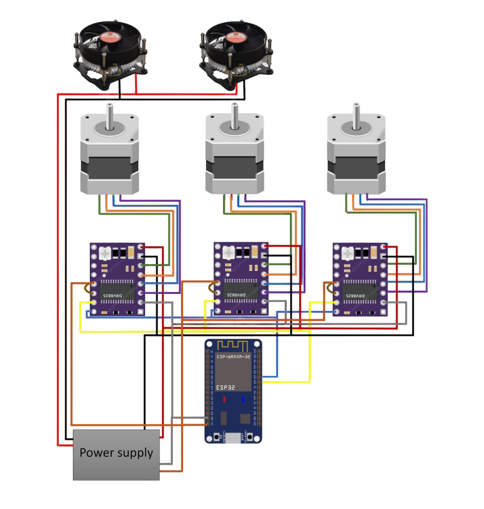

# Multi-Level Car Garage Esp32 Code

This repository contains the Arduino code for the **Multi-Level Car Garage Project**, a smart parking system designed to efficiently manage vehicles across multiple levels using automated mechanisms.

---

## 📖 Overview

The code leverages an **Arduino-based microcontroller** to control stepper motors and manage the garage's movement system. It includes functionality for Bluetooth communication, enabling remote operation and efficient vehicle placement in designated slots.

---

## 📊 System Diagram

Below is the system diagram of the multi-level car garage showing how the parking structure and automated mechanisms are organized:

---

## 🚀 Features

- **Stepper Motor Control**: Manages precise movements for lifting and parking vehicles.
- **Bluetooth Integration**: Allows remote commands for slot allocation and vehicle retrieval.
- **Slot Management**: Dedicated functions for adding and removing vehicles from each slot.
- **Bi-Directional Control**: Supports clockwise and counterclockwise motor movements.
- **Dynamic Speed Adjustment**: Ensures smooth and controlled motor operations.

---

## 📂 Code Structure

- **Libraries Used**:
  - `DRV8825.h`: For controlling the DRV8825 stepper motor driver.
  - `Stepper.h`: For managing stepper motor operations.
  - `BluetoothSerial.h`: For Bluetooth communication with external devices.

- **Core Functions**:
  - `slot_X()` and `slot_X_remove()`: Handle parking and retrieval operations for each slot.
  - `setup()`: Initializes Bluetooth and motor control settings.
  - `loop()`: Listens for Bluetooth commands and triggers appropriate motor actions.

---

## ⚙️ System Requirements

- **Microcontroller**: STM32 or ESP32.
- **Motor Driver**: DRV8825 stepper motor driver.
- **Motors**: Compatible stepper motors with required torque.
- **Bluetooth Module**: For remote command reception.
- **Power Supply**: Adequate power for motors and electronics.

---

## 🔧 How to Use

1. **Upload the Code**:
   - Open the `.ino` file in the Arduino IDE.
   - Connect your microcontroller via USB.
   - Select the appropriate board and COM port.
   - Upload the code to the microcontroller.

2. **Set Up the Hardware**:
   - Connect stepper motors to the DRV8825 drivers.
   - Configure the Bluetooth module for communication.
   - Ensure proper power supply connections.

3. **Control the System**:
   - Use a Bluetooth-enabled device to send commands to the microcontroller.
   - Command Format:
     - **Positive Values**: Move the motor clockwise.
     - **Negative Values**: Move the motor counterclockwise.
     - **Specific Numbers**: Trigger parking or retrieval operations for a slot.

---

## 📝 Example Commands

- **Park a Car in Slot 1**:
  Send `1` via Bluetooth to trigger the `slot_1()` function.
- **Retrieve a Car from Slot 1**:
  Send `-1` via Bluetooth to trigger the `slot_1_remove()` function.
- **Custom Motor Movement**:
  Send values between `10` and `25600` for custom clockwise motion or `-10` to `-25600` for counterclockwise motion.

---

## 📄 License

This project is open-source and available under the [MIT License](LICENSE).

---

## 🤝 Contributions

Contributions and improvements are welcome! Feel free to fork the repository and submit a pull request.

---

## ✉️ Contact

For questions or feedback, reach out:
- **Email**: omar.algamel@example.com
- **GitHub**: [Omar Algamel](https://github.com/omar-algamel)

---

Thank you for using the Multi-Level Car Garage Code! 🚗🏢
